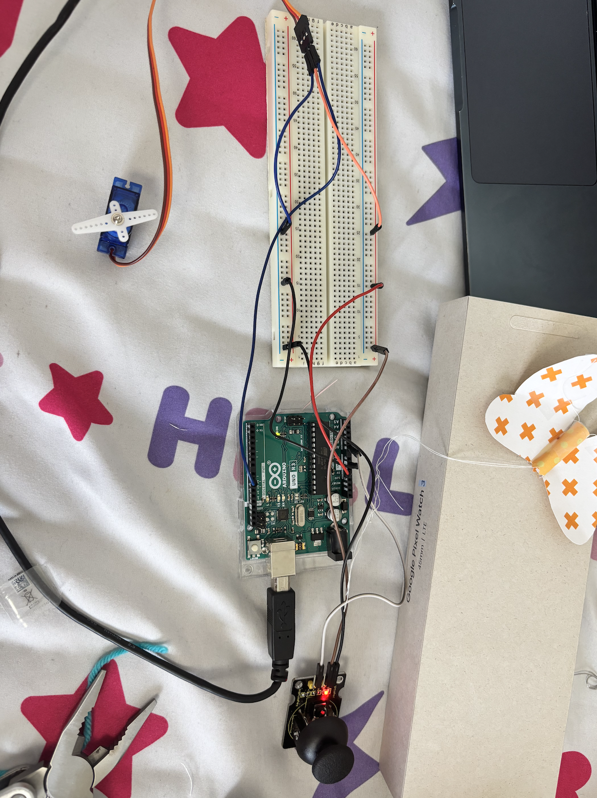
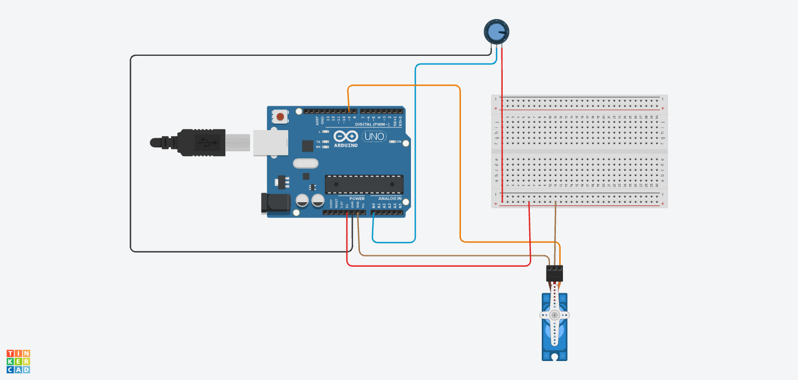

# First Arduino project!

Submission to outpost
For this project I used a breadboard, servo motor, uno r3, and joystick to create a moving butterfly. \n 
I began this project with no prior bread boarding experience after seeing Arduino projects online and deciding to learn the fundamentals from scratch.

## Parts Used
 - Breadboard X 1
 - Servo Motor X 1
 - Uno r3 X 1
 - Joystick X 1
 - Paper scraps X 1

## Final project
The final project hides all of the compnents except for the servo motor and the joystick in a box. The butterfly sits on top with the servo motor which is controlled by the joystick. When the joystick is moved, the string holding the butterfly moves flapping its wings.

### Files
 - .ino - c++ code that controls the arduino
 - .brd - Electrical model of the breadboard circuit (made on tinkercad)
 - .csv - parts list

Take a peak at how I made it in journal.md
